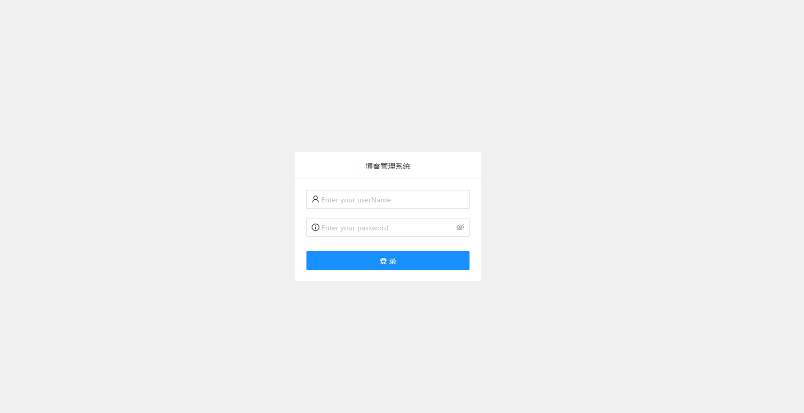
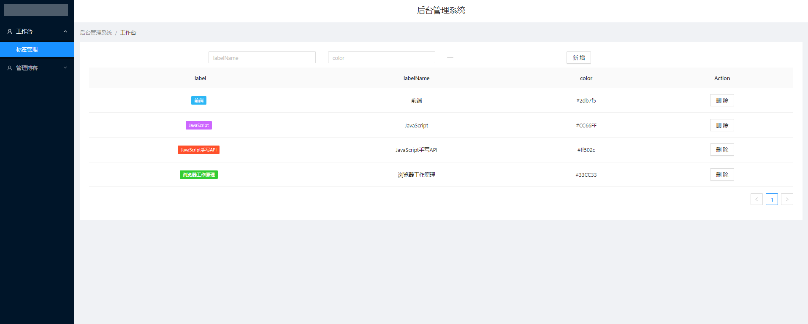
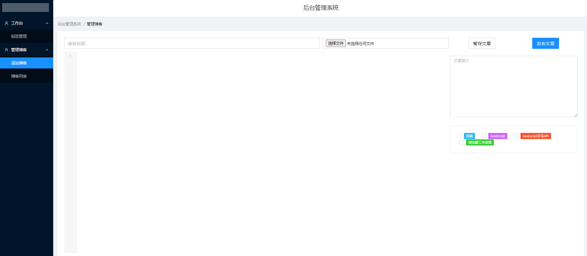
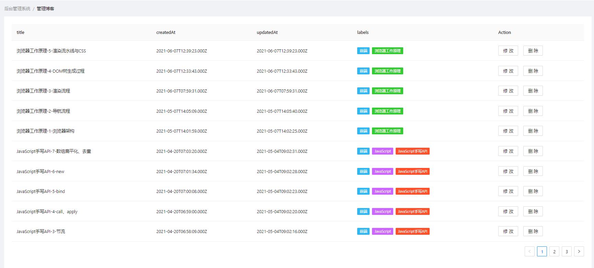

# 个人博客-4-博客后台前端.md
博客后台前端的作用是提供博主用于管理博客、标签的功能，同样需要从后端获取数据，同时也会有修改的交互。  
博客后台前端使用React作为UI库，同时搭配了React-Router；使用了Ant Design作为UI组件库，使用Axios进行HTTP通信，使用基于codemirror的HyperMD作为MarkDown的网页编辑器和效果实时展示。
## 安装使用
此前端项目使用create-react-app搭建，其开发过程依赖于Node.js，生成的Build文件夹后部署无需Node.js。在下载运行前，要确保已经安装了Node.js，最新稳定版即可。
### 安装过程
第一步，下载并安装依赖
```
//下载前端项目
git clone https://github.com/WN921/blog_admin.git

// 进入项目目录后，安装运行依赖
cd blog_admin

npm install --registry=https://registry.npm.taobao.org
```
第二步，修改网络请求的配置文件
进入项目下src/API目录，打开config.js，修改其中的baseUrl常量，将其修改为后端项目的URL（如：http://1.15.125.162:3100）。  

第三步，启动项目，运行无误后可二次开发，最后生成Build文件夹部署。
```
//启动项目
npm start

//生成build文件夹
npm run build
```
## 管理后台页面介绍
### 登录页面
使用Ant Design搭建的常见登录页面，输入账号密码后登录。


### 标签管理页面
用于对账号下标签进行增删查。


### 添加博客页面
添加博客页面最基本的功能是对直接从侧边栏点击进入后输入相应信息以添加一篇新博客。


另一个功能是从博客列表页面（见下方）中点击某一篇博客的修改按钮进入，此时页面会自动加载待修改博客，点击发布文章结果会是修改已经的博客。

### 博客列表页面
博客列表页面用于对已有博客进行删改查管理。


## 源码结构
```
│  App.js
│  index.js
│
├─API
│      config.js
│      request.js
│
├─pages
│      AddBlog.js
│      AdminIndex.js
│      BlogList.js
│      index.js
│      Label.js
│      Login.js
│
└─static
    └─css
            AddBlog.css
            AdminIndex.css
            comm.css
            Login.css
```

相较于博客网站前端，博客后台前端结构更简单。一是项目简单所以没有使用css-in-js的库，二是组件之间的交互较简单，不需要用到redux。
* App.js和index.js是整个项目的入口文件。
* API文件下，config.js设置请求的后端地址，request.js封装了后端提供的接口便于在各个组件内使用。
* pages就是各个页面对应的文件，基本和上一节的图片一一对应。
* static是用到的一些css文件。